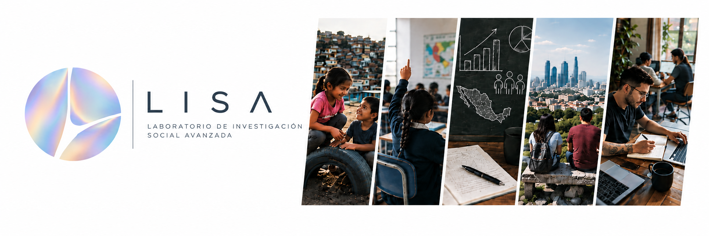

  

<h1 align="center">
  <strong>Laboratorio de Investigación Social Avanzada</strong>
</h1>

**LISA** es una empresa dedicada al desarrollo, revisión y difusión de investigación social aplicada a temas relacionados con el desarrollo social en México. Nos especializamos en métodos cuantitativos, análisis territorial y evaluación de políticas públicas.
<h2>Proyectos</h2>

## Proyectos

<table>
  <tr>
    <td width="50%" valign="top">
      <h3>Atlas de Riesgos para la Nutrición de la Niñez en México</h3>
      

        <a href="proyectos/atlas-riesgos/programas/">
          <strong>Accede a los programas de cálculo →</strong>
        </a>
      

    </td>

    <td width="50%" valign="top">
      <h3>Modelo de optimización geoespacial para los Centros de Educación y Cuidado Infantil del IMSS</h3>
      
<strong>Próximamente</strong>

    </td>
  </tr>

  <tr>
    <td colspan="2" valign="top">
      <h3>Cuestionario de Arquitectura Social del Aprendizaje</h3>
      
<strong>Próximamente</strong>

    </td>
  </tr>
</table>

<h2>Dirección</h2>

<strong>Antonio Villalpando-Acuña</strong>

## Red de colaboración

- [Ángel Leyva Murguía](https://www.linkedin.com/in/angel-leyva-murguia-1b9347a6/)
- [David Calderón Martín del Campo](https://www.linkedin.com/in/david-e-calderón-martín-del-campo-79b7ab16/)
- Fernando Ruiz Ruiz
- [Luis Daniel Rodríguez](https://www.linkedin.com/in/luis-daniel-rodríguez-27a0b5273/)
- [Gustavo Rojas Ayala](https://www.linkedin.com/in/gustavorojasayala/)
 

## Contacto

profesorvillalpando@gmail.com
